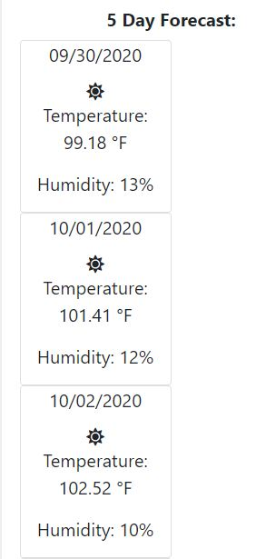

# weather-dashboard

A weather dashboard that provides up to date weather forecast for user selected city, as well as a 5 day forecasts, that uses APIs to pull data from several sources. 

## Table of Contents

* [Tech Used](#tech_used)
* [Usage](#usage)
* [Features](#features)
* [Deployed_Link](#deployed_link)
* [Author](#author)
* [Credits](#credits)
* [License](#license)

----

## Tech Used

* [HTML](https://developer.mozilla.org/en-US/docs/Web/HTML)
* [Bootstrap](https://getbootstrap.com/)
* [Javascript](https://developer.mozilla.org/en-US/docs/Web/JavaScript)
* [JQuery](https://jquery.com/)
* [Moment.js](https://momentjs.com/)
* [Font_Awesome](https://fontawesome.com/)

## Usage
 
 This dashboard when prompted by a user with a city text input will provide the date, current weather icon, temperature, humidity, wind speed and UV levels. An additional window appears providing a 5 days forecast with dates, weather icon, temperature and humidity.

## Features

- Displays weather searches by selected city and prepends city to search history.
  

- Provides a 5 day forecast...
  

- Utilizes 2 APIs for data calls.

- Icon's coded to current weather conditions.

## Deployed Link

* [See Live Site](https://ajhuff7.github.io/weather-dashboard/)

---

## Author

**AJ Huff** 

- [Portfolio Site](#)
- [Github](https://github.com/ajhuff7)
- [LinkedIn](https://www.linkedin.com/in/aj-huff-7696b14b/)

## Credits

**I need a vacation....**

## License

 